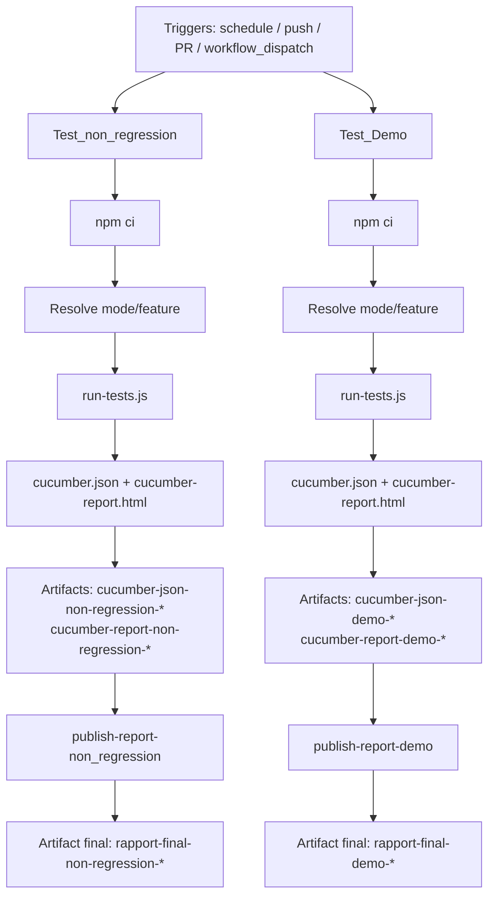

# CI/CD — Pipeline GitHub Actions

Ce document décrit le workflow [`.github/workflows/ci.yml`](../../../.github/workflows/ci.yml).

## Objectif

Le pipeline lance deux campagnes de tests en parallèle logique :

1. campagne **non-régression**
2. campagne **démo**

Chaque campagne produit ses propres artefacts pour éviter tout mélange de rapports.

## Schéma d'architecture

## Déclencheurs

Le workflow est déclenché par :

- `schedule` : tous les jours à `07:00 UTC` (09:00 heure de Paris en UTC+2)
- `push` : branches `main`, `develop`
- `pull_request` : branche `main`
- `workflow_dispatch` : lancement manuel

Paramètres workflow_dispatch :

| Paramètre | Valeurs | Défaut | Rôle |
|---|---|---|---|
| `env` | `Recette1`, `Recette2` | `Recette1` | Sélection de l'environnement GitHub |
| mode | all, demo, cas_passant, cas_non_passant, non_regression | non_regression | Sélection de campagne |
| `feature` | nom de feature | vide | Si rempli, prioritaire sur `mode` |

## Logique d'exécution

Règle de priorité :

1. si `feature` est renseigné, la commande est forcée sur cette feature
2. sinon, la commande est choisie selon `mode`

Commande appliquée si feature est renseigné :

node features/support-scripts/run-tests.js features/<feature>

Mapping mode -> script npm (job non-régression) :

| Mode | Script |
|---|---|
| cas_passant | npm run test:CP |
| cas_non_passant | npm run test:CNP |
| non_regression (par défaut) | npm run test:non_regression --if-present \|\| npm run test:regression |
| all | npm run test:non_regression --if-present \|\| npm run test:regression |
| demo | Job non-régression ignoré |

Mapping mode -> script npm (job démo) :

| Mode | Script |
|---|---|
| demo | npm run test:demo |
| all | npm run test:demo |
| cas_passant, cas_non_passant, non_regression | Job démo ignoré |

Note: le fallback non-régression vers test:regression protège les anciens contextes où ce nom de script est encore utilisé.

## Jobs détaillés

### Job `Test_non_regression`

- dépendances: aucune
- environnement: `${{ github.event.inputs.env || 'Recette1' }}`
- condition d'exécution:
  - événements automatiques: toujours exécuté
  - workflow_dispatch: exécuté sauf si mode=demo
- commande par défaut: npm run test:non_regression --if-present || npm run test:regression
- artefacts produits:
  - `cucumber-json-non-regression-<run_number>`
  - `cucumber-report-non-regression-<run_number>`

### Job `Test_Demo`

- dépendances: aucune
- environnement: `${{ github.event.inputs.env || 'Recette1' }}`
- condition d'exécution:
  - événements automatiques: toujours exécuté
  - workflow_dispatch: exécuté si mode=demo ou mode=all
- commande par défaut: npm run test:demo
- artefacts produits:
  - `cucumber-json-demo-<run_number>`
  - `cucumber-report-demo-<run_number>`

### Job `publish-report-non_regression`

- `needs: Test_non_regression`
- télécharge `cucumber-report-non-regression-<run_number>`
- republie `rapport-final-non-regression-<run_number>`

### Job `publish-report-demo`

- `needs: Test_Demo`
- télécharge `cucumber-report-demo-<run_number>`
- republie `rapport-final-demo-<run_number>`

## Comportement important

Le mode manuel contrôle quels jobs s'exécutent:

| mode | Test_non_regression | Test_Demo |
|---|---|---|
| demo | ignoré | exécuté |
| cas_passant | exécuté | ignoré |
| cas_non_passant | exécuté | ignoré |
| non_regression | exécuté | ignoré |
| all | exécuté | exécuté |

Si feature est renseigné, chaque job actif exécute exactement la feature demandée.

## Runner de tests

Le script `features/support-scripts/run-tests.js` :

- transmet les arguments Cucumber (`--tags`, `--format`, feature)
- génère le rapport HTML même en cas d'échec
- retourne le code de sortie pour que le job soit correctement marqué en succès/échec

## Secrets et environnements

Les jobs lisent les secrets depuis l'environnement GitHub choisi (`Recette1` ou `Recette2`) :

- `API_USERNAME`
- `API_PASSWORD`
- `LOGIN_BDD`
- `PWS_BDD`
- `API_BASE_URL`

`CI=true` est injecté dans les jobs.

Configuration GitHub attendue :

1. créer les environnements `Recette1` et `Recette2`
2. définir les mêmes secrets dans chaque environnement
