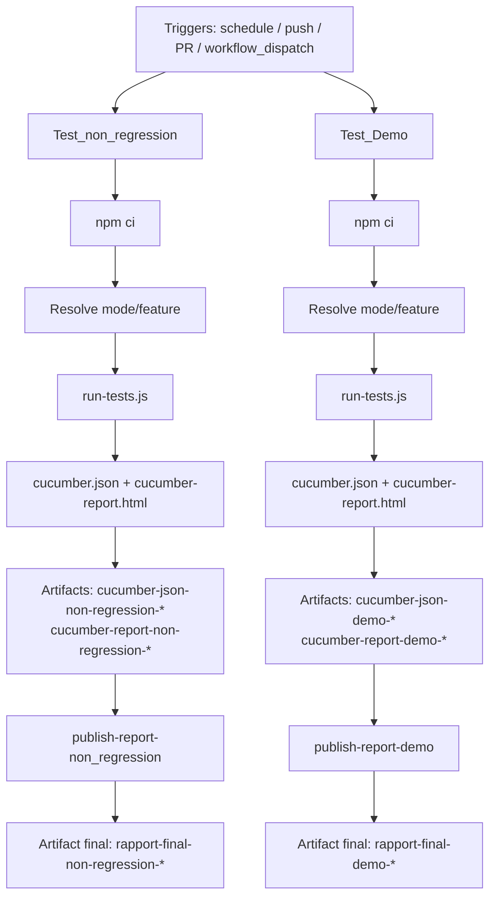

# CI/CD — Pipeline GitHub Actions

Ce document décrit le workflow [`.github/workflows/ci.yml`](../../../.github/workflows/ci.yml).

## Objectif

Le pipeline lance deux campagnes de tests en parallèle logique :

1. campagne **non-régression**
2. campagne **démo**

Chaque campagne produit ses propres artefacts pour éviter tout mélange de rapports.

## Schéma d'architecture

## Déclencheurs

Le workflow est déclenché par :

- `schedule` : tous les jours à `09:00 UTC`
- `push` : branches `main`, `develop`
- `pull_request` : branche `main`
- `workflow_dispatch` : lancement manuel

Paramètres `workflow_dispatch` :

| Paramètre | Valeurs | Défaut | Rôle |
|---|---|---|---|
| `env` | `Recette1`, `Recette2` | `Recette1` | Sélection de l'environnement GitHub |
| `mode` | `demo`, `cas_passant`, `cas_non_passant`, `non_regression` | `non_regression` | Commande de test à exécuter |
| `feature` | nom de feature | vide | Si rempli, prioritaire sur `mode` |

## Logique d'exécution

Règle de priorité :

1. si `feature` est renseigné, la commande est forcée sur cette feature
2. sinon, la commande est choisie selon `mode`

Commande appliquée si `feature` est renseigné :

`node features/support-scripts/run-tests.js features/<feature>`

Mapping `mode` -> script npm :

| Mode | Script |
|---|---|
| `demo` | `npm run test:demo` |
| `cas_passant` | `npm run test:CP` |
| `cas_non_passant` | `npm run test:CNP` |
| `non_regression` | `npm run test:non_regression` |

## Jobs détaillés

### Job `Test_non_regression`

- dépendances: aucune
- environnement: `${{ github.event.inputs.env || 'Recette1' }}`
- commande par défaut (hors `workflow_dispatch`): `npm run test:non_regression`
- artefacts produits:
  - `cucumber-json-non-regression-<run_number>`
  - `cucumber-report-non-regression-<run_number>`

### Job `Test_Demo`

- dépendances: aucune
- environnement: `${{ github.event.inputs.env || 'Recette1' }}`
- commande par défaut (hors `workflow_dispatch`): `npm run test:demo`
- artefacts produits:
  - `cucumber-json-demo-<run_number>`
  - `cucumber-report-demo-<run_number>`

### Job `publish-report-non_regression`

- `needs: Test_non_regression`
- télécharge `cucumber-report-non-regression-<run_number>`
- republie `rapport-final-non-regression-<run_number>`

### Job `publish-report-demo`

- `needs: Test_Demo`
- télécharge `cucumber-report-demo-<run_number>`
- republie `rapport-final-demo-<run_number>`

## Comportement important

Le paramètre manuel `mode` est partagé par les deux jobs de test. Donc, en `workflow_dispatch`, si tu choisis `mode=demo`, les deux jobs exécuteront `test:demo` (sauf si `feature` est fournie). C'est le comportement actuel du YAML.

## Runner de tests

Le script `features/support-scripts/run-tests.js` :

- transmet les arguments Cucumber (`--tags`, `--format`, feature)
- génère le rapport HTML même en cas d'échec
- retourne le code de sortie pour que le job soit correctement marqué en succès/échec

## Secrets et environnements

Les jobs lisent les secrets depuis l'environnement GitHub choisi (`Recette1` ou `Recette2`) :

- `API_USERNAME`
- `API_PASSWORD`
- `LOGIN_BDD`
- `PWS_BDD`
- `API_BASE_URL`

`CI=true` est injecté dans les jobs.

Configuration GitHub attendue :

1. créer les environnements `Recette1` et `Recette2`
2. définir les mêmes secrets dans chaque environnement
